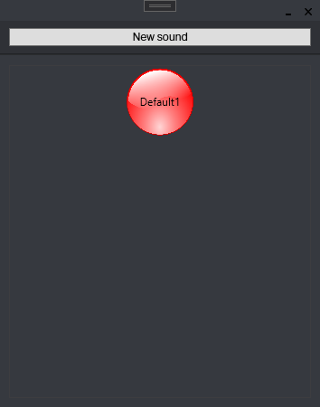

# Project Sonos

## What is Project Sonos?
Project Sonos is a .NET soundboard made in WPF with an emphasis on the user interface.

## How do you handle the audio?
I'm using the [NAudio library for .NET](https://github.com/naudio/NAudio) although I have some trouble making it work the right way for now.

## Are there more features coming in the future?
Yep. It's a project I'm really keen on to finish as I really want to use it myself! What is keeping me off working on it is that handling audio is really complicated as I don't know nothing about sound and I want to make an efficient software so I might have to dive deeper into NAudio documentation and how sounds works in a computer. [Here you can see what i'm working on if you're interested.](https://trello.com/b/moOdRRoV/project-sonos)

