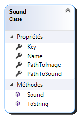

# Project Sonos

Project Sono est une banque de son interactive développée en WPF.
L'utilisateur peut donc ajouter un son, lui assigner une image, un nom et une touche du clavier afin de pouvoir activer le son n'importe quand.
J'utilise la bibliothèque NAudio pour m'occuper de la gestion des sons.

## Interface 


---

## Classe de son



```
public class Sound : INotifyPropertyChanged
    {
        private ImageBrush image;
        private MediaPlayer mediaPlayer;
        private Key? key;
        private string name;
        private string pathToSound;
        static private double volume = 0.5;
        public event PropertyChangedEventHandler PropertyChanged;

        public Sound()
        {
            this.Name = "New sound";
            this.Key = null;
            this.PathToSound = "none";
            this.image = null;
            this.mediaPlayer = new MediaPlayer();
        }

        public MediaPlayer MediaPlayer
        {
            get { return this.mediaPlayer; }
        }

        public string Name {
            get { return this.name; }
            set { this.name = value; }
        }

        public string PathToSound {
            get { return this.pathToSound; } 
            set { this.pathToSound = value; }
        }

        public Key? Key {
            get { return this.key; } 
            set { 
                this.key = value;
                OnPropertyChanged();
            } 
        }

        public ImageBrush Image
        {
            get
            {
                if (this.image == null)
                {
                    image = new ImageBrush();
                    BitmapImage bit = new BitmapImage();
                    bit.BeginInit();
                    bit.CreateOptions = BitmapCreateOptions.IgnoreImageCache;
                    bit.CacheOption = BitmapCacheOption.OnLoad;
                    bit.UriSource = new Uri("pack://application:,,,/Resources/1200px-Button_Icon_Red.svg.png");
                    bit.EndInit();
                    image.ImageSource = bit;
                }
                return image;
            }
            set
            {
                this.image = value;
            }
        }

        static public double Volume
        {
            set { Sound.volume = value; }
            get { return Sound.volume; }
        }

        public void ChangeImage(string path)
        {
            BitmapImage bit = new BitmapImage();
            bit.BeginInit();
            bit.CreateOptions = BitmapCreateOptions.IgnoreImageCache;
            bit.CacheOption = BitmapCacheOption.OnLoad;
            bit.UriSource = new Uri(path);
            bit.EndInit();
            this.image.ImageSource = bit;
        }

        public void ChangeSound(string path)
        {
            this.PathToSound = path;
        }

        public void PlaySound()
        {
            if (this.PathToSound != "none")
            {
                mediaPlayer.Volume = Sound.volume;
                mediaPlayer.Open(new Uri(this.PathToSound));
                mediaPlayer.Play();
            }
        }

        protected void OnPropertyChanged([CallerMemberName] string key = null)
        {
            PropertyChanged?.Invoke(this, new PropertyChangedEventArgs(key));
        }

        public override string ToString()
        {
            return this.Name;
        }
    }
```

https://trello.com/b/moOdRRoV/project-sonos
