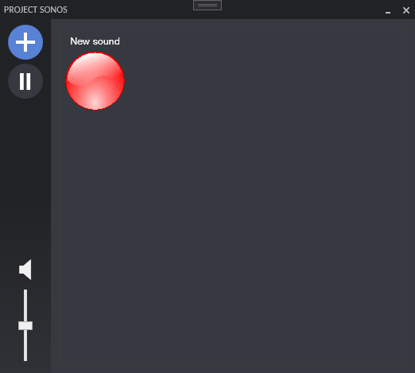

# Project Sonos

Project Sono est une banque de son interactive en WPF.

## Interface 



---

## Classe de son


```
public class Sound
{
    public Sound()
    {
        this.Name = "Default1";
        this.Key = "Default2";
        this.PathToSound = "Default3";
        this.PathToImage = "Default4";
    }

    public string Name { get; set; }
    public string PathToSound { get; set; }
    public string Key { get; set; }
    public string PathToImage { get; set; }
    public override string ToString()
    {
        return this.Name;
    }
}
```
